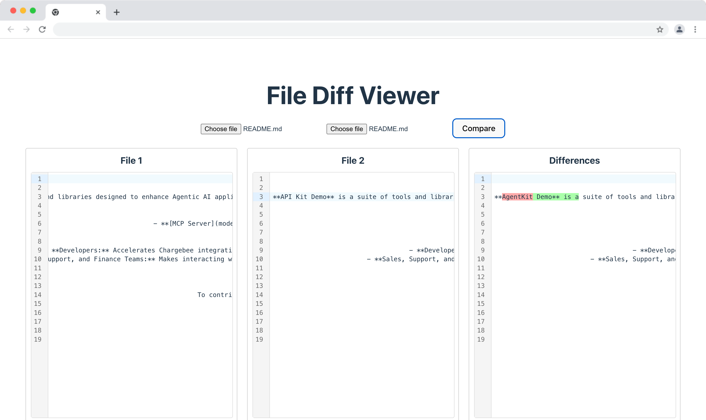

# File Diff Viewer

Upload two files and see the diff between them.




## Tools learnt

* Code Mirror 6
* Vite

**TODO**
- [ ] Need to learn more about the diff algorithm
- [ ] Need to explore more about codemirror

## Summary:
- Uses **EditorView** to create a new editor
- **EditorState** manages the overall state of the editor
  - **`StateField`** is for holding and updating custom state data within the `EditorState`. It is used when you need to store values and track changes based on editor interactions.
  - **`StateEffect`** is for applying transformations or side-effects to the editor's state. It's used when you want to trigger changes in the editor, like modifying the document, triggering actions, or updating other state fields.

  ### When to Use:
  - **Use `StateField`** when you need to store some data related to the editor’s state (e.g., line number, metadata, tracking specific markers).
  - **Use `StateEffect`** when you want to perform actions that modify the editor or trigger certain operations (e.g., applying a theme, changing a setting, or triggering an animation).


## Setup

```
npm install
npm run dev
```


